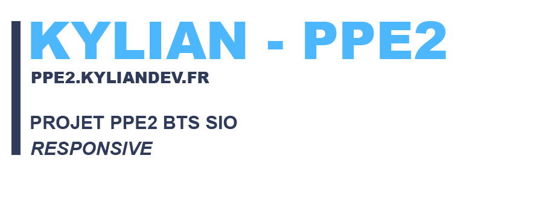
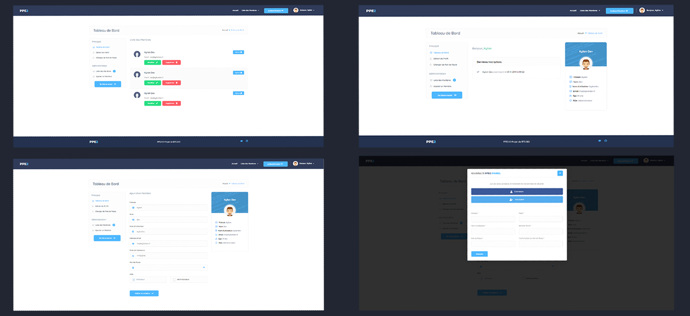
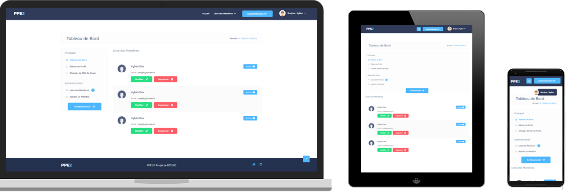

> Bienvenue sur la page GitHub de mon PPE2 de BTS SIO

### 📌 Démo
- Site Web Démo : <a href="https://www.ppe2.kyliandev.fr" target="_blank">`ppe2.kyliandev.fr`</a>
- Utilisateur : demo
- Mot de Passe : demo123456,

### 🔍 Aperçus
> Aperçus créés sur Photoshop

### 🔍 Responsive
> Adaptable PC, Tablette & Smartphone

### 📌 Procédure d'Installation
- Créer un base de données nommée 'ppe2_database' (MySQL)
- Importer le fichier .sql qui se trouve dans 'backend/includes/db.sql'
- Configurer le fichier 'backend/includes/db_inc.php' et y entrer les paramètres d'accès à la base de données
> Généralement : Hôte : localhost, Username : root, Password : (Vide), Nom de la base : ppe2_database
- Accéder au Site en tapant 'localhost' sur votre navigateur web

### 📌 Tâches Restantes
- Optimisation du Code (Classe Utilisateur)
- Intégration du Back-end sur l'Accès Client (Dashboard.php)
- Demande d'Autorisation de l'usage des Cookies au Client

### 📌 Contact
> Contacter moi via les supports suivant

- Site Web : <a href="https://www.kyliandev.fr" target="_blank">`kyliandev.fr`</a>
- Linkedin : <a href="https://www.linkedin.com/in/kyliandev/" target="_blank">`@kyliandev`</a>

### 🔒 License

- Peut-être repris et modifié.
- Aucun droit n'a été déposé.